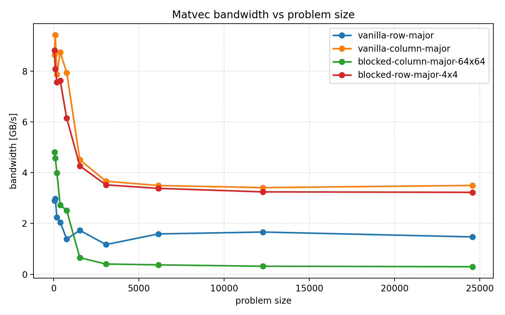

# Exercise 4: Matrix-Vector Multiplication

The plot shows the measured bandwidth for the four matrix-vector multiplication variants. Higher bandwidth means better performance.

For small matrices, all methods benefit from good cache locality and the measured bandwidth is relatively high. As the problem size grows, the curves flatten because the working set no longer fits well into cache and performance becomes limited by memory traffic.

The best overall result is the vanilla column-major variant, `matvec2`. It reaches the highest bandwidth for almost all problem sizes and stays around 3.3 to 3.5 GB/s for large matrices. The blocked row-major version, `matvec4`, is the second-best method. It is clearly faster than the simple row-major implementation and much better than the blocked column-major version, but it still does not beat the column-major vanilla code for large inputs.

In this run, `matvec4` uses the fixed unrolling block size of 4 from the exercise statement. I did not sweep additional unroll factors, so the plot only shows the 4x4 variant.

The simple row-major implementation, `matvec1`, is the slowest of the two vanilla variants. Its bandwidth stays around 1.4 to 1.8 GB/s for larger matrices. The blocked column-major variant, `matvec3`, performs well for small sizes, but it drops sharply once the matrix becomes large. For the largest problem sizes it is by far the worst variant, which suggests that this blocking strategy does not help enough to compensate for the access pattern and cache pressure.

Overall, the ranking for large matrices is:

`matvec2` > `matvec4` > `matvec1` > `matvec3`

This matches the idea from the lecture that memory access patterns dominate performance for this benchmark. The blocked row-major approach improves instruction-level parallelism, but the column-major access pattern of `matvec2` is still more favorable for this setup.

The bonus part about removing `-fno-tree-vectorize` was not evaluated here.
