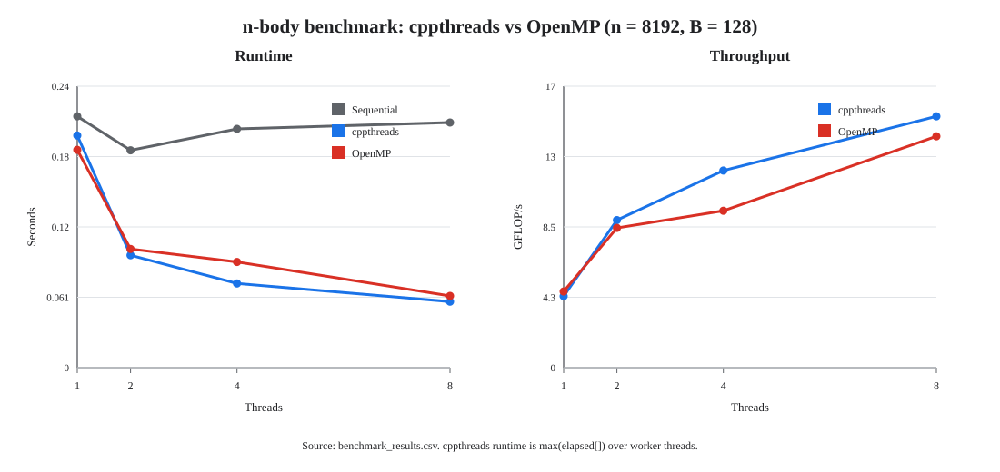

Question 2

a) 

1. The work distribution aspect:

Because the problem is symmetrical (Newton's 3rd law) the work per row is essentially triangular (block row `I` only interacts with blocks `J >= I`) and the work per row drops from `O(n)` to `O(1)`.
In `power_method.cc` the work per row during the matrix-vector product operation is uniform which enables a balanced split of work between ranks. If we were to apply this pattern naively to the `nbody` problem heavy computation would be done by thread `0` and nearby rank threads and others would be underused. The solution lies in distributing block rows cyclically/dynamically. (This is also what `acceleration_blocked_omp_SoA.cc` does via `schedule(dynamic, 1)`.

2. Data races:

The data race is on the shared `aglobal` array, in the flush at the end of each block where `aglobal[...] += ...` is done. The race comes from the symmetry (Newton's 3rd law) again: when a thread processes block row `I` it doesn't only write its own block, it also writes the opposite forces into every partner block `J >= I`, and those blocks are owned by other threads' block rows. So the thread owning block row `J` flushes its `aI` into `aglobal[J...]` while another thread, currently on an earlier row `I < J`, flushes its `aJ` into the same `aglobal[J...]`, and updates get lost. If we applied the power method pattern naively (no protection) the result would be non-deterministic and wrong. The solution is one mutex per block, locked around each flush. 
(This is also what `acceleration_blocked_omp_SoA.cc` does via `std::vector<std::mutex> mutexes(n / B)` and a `lock_guard` on `mutexes[J / B]` / `mutexes[I / B]`, so that only flushes to the same block are serialized while different blocks stay parallel.)

b)

The implementation is in `acceleration_blocked_cppthreads_SoA.cc`. I benchmarked it against the OpenMP version `acceleration_blocked_omp_SoA` with `n = 8192` bodies, block size `B = 128`, and 1, 2, 4, and 8 threads. The machine reports 8 hardware threads. For the cppthreads version, the reported runtime is `max(elapsed[])`, exactly like `lambda_max_par` in `power_method.cc`: every worker stores its own measured runtime in `context->elapsed[rank]`, and the wrapper uses the maximum thread time for GFLOP/s and speedup.

The cppthreads implementation:

```cpp
struct GlobalContext
{
  int nthreads;
  int n;
  double *x;
  double *m;
  double *aglobal;
  std::vector<std::mutex> mutexes;
  Barrier barrier;
  std::vector<double> elapsed;

  GlobalContext(int P, int n_)
      : nthreads(P), n(n_), x(nullptr), m(nullptr), aglobal(nullptr),
        mutexes(n_ / B), barrier(P), elapsed(P, 0.0)
  {
  }
};

void acceleration_worker(std::shared_ptr<GlobalContext> ctx, int rank)
{
  const int n = ctx->n;
  const int P = ctx->nthreads;
  double *__restrict__ x = ctx->x;
  double *__restrict__ m = ctx->m;
  double *__restrict__ aglobal = ctx->aglobal;

  double *aI = new (std::align_val_t(64)) double[3 * B];
  double *aJ = new (std::align_val_t(64)) double[3 * B];

  ctx->barrier.wait(rank);
  auto t_start = get_time_stamp();

  for (int I = rank * B; I < n; I += P * B)
  {
    for (int i = 0; i < 3 * B; ++i)
      aI[i] = 0.0;

    for (int i = I; i < I + B; i++)
      for (int j = i + 1; j < I + B; j++)
      {
        double d0 = x[j] - x[i];
        double d1 = x[n + j] - x[n + i];
        double d2 = x[2 * n + j] - x[2 * n + i];
        double r2 = d0 * d0 + d1 * d1 + d2 * d2 + epsilon2;
        double r = sqrt(r2);
        double invfact = G / (r * r2);
        double factori = m[i] * invfact;
        double factorj = m[j] * invfact;
        aI[i - I] += factorj * d0;
        aI[i - I + B] += factorj * d1;
        aI[i - I + 2 * B] += factorj * d2;
        aI[j - I] -= factori * d0;
        aI[j - I + B] -= factori * d1;
        aI[j - I + 2 * B] -= factori * d2;
      }

    for (int J = I + B; J < n; J += B)
    {
      for (int j = 0; j < 3 * B; ++j)
        aJ[j] = 0.0;

      for (int i = I; i < I + B; i++)
        for (int j = J; j < J + B; j++)
        {
          double d0 = x[j] - x[i];
          double d1 = x[n + j] - x[n + i];
          double d2 = x[2 * n + j] - x[2 * n + i];
          double r2 = d0 * d0 + d1 * d1 + d2 * d2 + epsilon2;
          double r = sqrt(r2);
          double invfact = G / (r * r2);
          double factori = m[i] * invfact;
          double factorj = m[j] * invfact;
          aI[i - I] += factorj * d0;
          aI[i - I + B] += factorj * d1;
          aI[i - I + 2 * B] += factorj * d2;
          aJ[j - J] -= factori * d0;
          aJ[j - J + B] -= factori * d1;
          aJ[j - J + 2 * B] -= factori * d2;
        }

      {
        std::lock_guard<std::mutex> lock(ctx->mutexes[J / B]);
        for (int j = 0; j < B; ++j)
          aglobal[J + j] += aJ[j];
        for (int j = 0; j < B; ++j)
          aglobal[J + j + n] += aJ[j + B];
        for (int j = 0; j < B; ++j)
          aglobal[J + j + 2 * n] += aJ[j + 2 * B];
      }
    }

    {
      std::lock_guard<std::mutex> lock(ctx->mutexes[I / B]);
      for (int i = 0; i < B; ++i)
        aglobal[I + i] += aI[i];
      for (int i = 0; i < B; ++i)
        aglobal[I + i + n] += aI[i + B];
      for (int i = 0; i < B; ++i)
        aglobal[I + i + 2 * n] += aI[i + 2 * B];
    }
  }

  ctx->barrier.wait(rank);

  auto t_stop = get_time_stamp();
  ctx->elapsed[rank] = get_duration_seconds(t_start, t_stop);

  delete[] aI;
  delete[] aJ;
}

double acceleration_blocked_cppthreads_SoA(int P, int n,
                                           double *__restrict__ x,
                                           double *__restrict__ m,
                                           double *__restrict__ aglobal)
{
  auto ctx = std::make_shared<GlobalContext>(P, n);
  ctx->x = x;
  ctx->m = m;
  ctx->aglobal = aglobal;

  std::vector<std::thread> threads;
  threads.reserve(P - 1);
  for (int k = 1; k < P; ++k)
    threads.emplace_back(acceleration_worker, ctx, k);
  acceleration_worker(ctx, 0);
  for (auto &t : threads)
    t.join();

  double tmin = *std::min_element(ctx->elapsed.begin(), ctx->elapsed.end());
  double tmax = *std::max_element(ctx->elapsed.begin(), ctx->elapsed.end());
  std::cout << "per-thread elapsed [s]:";
  for (int k = 0; k < P; ++k)
    std::cout << " " << ctx->elapsed[k];
  std::cout << "\n  load balance: min=" << tmin << " max=" << tmax
            << " imbalance=" << (tmax > 0 ? tmax / std::max(tmin, 1e-12) : 1.0)
            << " (1.0 = perfect)\n";
  return tmax;
}
```



The measured runtimes were:

| Threads | Sequential time [s] | cppthreads time [s] | cppthreads GFLOP/s | cppthreads speedup | OpenMP time [s] | OpenMP GFLOP/s | OpenMP speedup |
|---:|---:|---:|---:|---:|---:|---:|---:|
| 1 | 0.218225 | 0.201562 | 4.32774 | 1.083 | 0.189116 | 4.61255 | 1.154 |
| 2 | 0.188784 | 0.097638 | 8.93411 | 1.934 | 0.103080 | 8.46248 | 1.831 |
| 4 | 0.207339 | 0.073101 | 11.9329 | 2.836 | 0.091797 | 9.50263 | 2.259 |
| 8 | 0.212848 | 0.057325 | 15.2169 | 3.713 | 0.062263 | 14.0100 | 3.419 |

The cppthreads implementation is competitive with OpenMP. In this run, OpenMP was faster for 1 thread, while the raw `std::thread` version was faster for 2, 4, and 8 threads. Both implementations are sensitive to scheduling and mutex contention because updates to `aglobal` must be serialized per block. The numerical check passed in all cases; the maximum relative difference to the sequential reference stayed below `1e-10`.

Per-thread runtimes for cppthreads:

| Threads | elapsed[] [s] | max/min imbalance |
|---:|---|---:|
| 1 | `0.201562` | 1.000 |
| 2 | `0.097539 0.097638` | 1.001 |
| 4 | `0.073076 0.073070 0.073076 0.073101` | 1.000 |
| 8 | `0.057284 0.057190 0.057261 0.057308 0.057264 0.057228 0.057193 0.057325` | 1.002 |

The load is well balanced. The cyclic distribution of block rows avoids the triangular-work imbalance that a contiguous distribution would create. For 2, 4, and 8 threads, the slowest thread is only about 0.1% to 0.2% slower than the fastest thread. This shows that the computation is balanced; the remaining speedup limit is more likely from synchronization on the per-block mutexes, memory effects, and thread-management overhead than from uneven work distribution.
